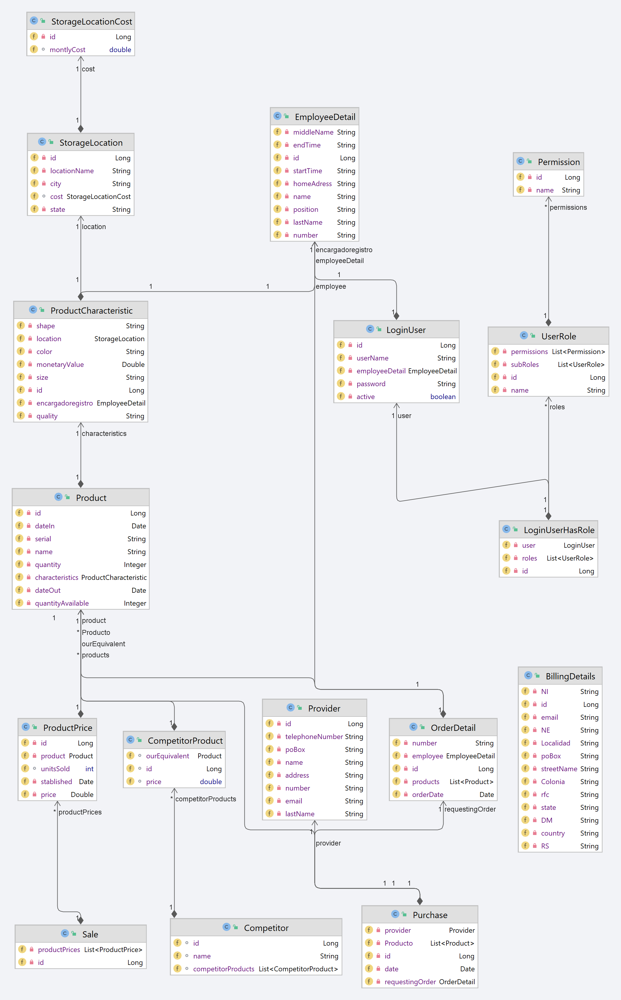
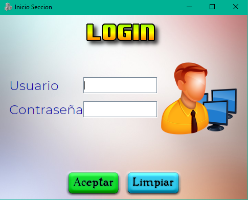

## Inventory System

  Linux Build 
  
  Windows Build 
  
   
 

It has two related systems, a rest service for an Inventory Management System and a system for Desktop client.

Database Model
---

**Note:** This project uses an in-memory database for demo purposes, you should add the driver dependency of your Database in the `pom.xml` and your user and password in the `application.properties` in order to make it work with your database. 

Screenshots
---

